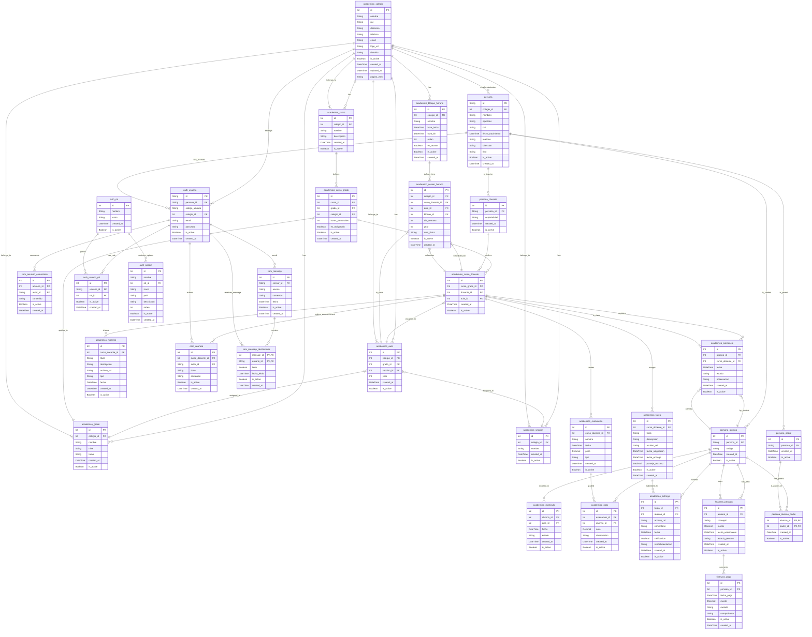

```mermaid
erDiagram
    %% Core Entities
    academico_colegio ||--o{ academico_aula : has
    academico_colegio ||--o{ academico_grado : has
    academico_colegio ||--o{ academico_seccion : has
    academico_colegio ||--o{ academico_bloque_horario : has
    academico_colegio ||--o{ academico_curso : has
    academico_colegio ||--o{ auth_usuario : employs
    academico_colegio ||--o{ persona : "employs/educates"

    %% Academic Structure
    academico_aula }|--|| academico_colegio : belongs_to
    academico_aula }|--|| academico_grado : assigned_to
    academico_aula }|--|| academico_seccion : assigned_to
    
    academico_grado }|--|| academico_colegio : belongs_to
    academico_seccion }|--|| academico_colegio : belongs_to
    
    %% Course Management
    academico_curso ||--o{ academico_curso_grado : defines
    academico_curso }|--|| academico_colegio : belongs_to
    academico_curso_grado }|--|| academico_grado : applies_to
    academico_curso_grado ||--o{ academico_curso_docente : taught_by
    
    %% Personnel Relations
    persona ||--o{ auth_usuario : has_account
    persona ||--o{ persona_alumno : "is_student"
    persona ||--o{ persona_docente : "is_teacher"
    persona ||--o{ persona_padre : "is_parent"
    
    %% Teacher Assignments
    persona_docente ||--o{ academico_curso_docente : teaches
    academico_curso_docente }|--|| academico_aula : assigned_to
    academico_curso_docente ||--o{ academico_asistencia : registers
    academico_curso_docente ||--o{ academico_evaluacion : creates
    academico_curso_docente ||--o{ academico_material : shares
    academico_curso_docente ||--o{ academico_tarea : assigns
    academico_curso_docente ||--o{ com_anuncio : "makes_announcement"
    academico_curso_docente ||--o{ academico_sesion_horario : schedules
    
    %% Student Assignments
    persona_alumno ||--o{ academico_asistencia : attends
    persona_alumno ||--o{ academico_matricula : enrolled_in
    persona_alumno ||--o{ academico_nota : receives
    persona_alumno ||--o{ academico_entrega : submits
    persona_alumno ||--o{ finanzas_pension : "has_debt"
    persona_alumno ||--o{ persona_alumno_padre : "has_parent"
    
    %% Parent Relations
    persona_padre ||--o{ persona_alumno_padre : "is_parent_of"
    
    %% Attendance Tracking
    academico_asistencia }|--|| persona_alumno : by_student
    academico_asistencia }|--|| academico_curso_docente : in_class
    
    %% Evaluation System
    academico_evaluacion ||--o{ academico_nota : graded
    
    %% Task Management
    academico_tarea ||--o{ academico_entrega : submitted_for
    
    %% Schedule Management
    academico_bloque_horario ||--o{ academico_sesion_horario : defines_time
    academico_sesion_horario }|--|| academico_aula : in_room
    academico_sesion_horario }|--|| academico_curso_docente : scheduled_for
    
    %% Financial Management
    persona_alumno ||--o{ finanzas_pension : owes
    finanzas_pension ||--o{ finanzas_pago : payments
    
    %% Communication System
    auth_usuario ||--o{ com_anuncio : authors
    auth_usuario ||--o{ com_anuncio_comentario : comments
    auth_usuario ||--o{ com_mensaje : sends
    com_mensaje ||--o{ com_mensaje_destinatario : receives
    auth_usuario ||--o{ com_mensaje_destinatario : "receives_message"
    
    %% Authorization System
    auth_usuario ||--o{ auth_usuario_rol : has_role
    auth_rol ||--o{ auth_usuario_rol : grants
    auth_rol ||--o{ auth_opcion : contains_options
    
    %% Core Tables with Attributes
    academico_colegio {
        Int id PK
        String nombre
        String ruc
        String direccion
        String telefono
        String email
        String logo_url
        String dominio
        Boolean is_active
        DateTime created_at
        DateTime updated_at
        String pagina_web
    }
    
    academico_aula {
        Int id PK
        Int colegio_id FK
        Int grado_id FK
        Int seccion_id FK
        Int year
        DateTime created_at
        Boolean is_active
    }
    
    academico_grado {
        Int id PK
        Int colegio_id FK
        String nombre
        String nivel
        String turno
        DateTime created_at
        Boolean is_active
    }
    
    academico_seccion {
        Int id PK
        Int colegio_id FK
        String nombre
        DateTime created_at
        Boolean is_active
    }
    
    persona {
        String id PK
        Int colegio_id FK
        String nombres
        String apellidos
        String dni
        DateTime fecha_nacimiento
        String telefono
        String direccion
        String foto
        Boolean is_active
        DateTime created_at
    }
    
    persona_alumno {
        Int id PK
        String persona_id FK
        String codigo
        DateTime created_at
        Boolean is_active
    }
    
    persona_docente {
        Int id PK
        String persona_id FK
        String especialidad
        DateTime created_at
        Boolean is_active
    }
    
    persona_padre {
        Int id PK
        String persona_id FK
        DateTime created_at
        Boolean is_active
    }
    
    academico_curso {
        Int id PK
        Int colegio_id FK
        String nombre
        String descripcion
        DateTime created_at
        Boolean is_active
    }
    
    academico_curso_grado {
        Int id PK
        Int curso_id FK
        Int grado_id FK
        Int colegio_id FK
        Int horas_semanales
        Boolean es_obligatorio
        Boolean is_active
        DateTime created_at
    }
    
    academico_curso_docente {
        Int id PK
        Int curso_grado_id FK
        Int docente_id FK
        Int aula_id FK
        DateTime created_at
        Boolean is_active
    }
    
    academico_asistencia {
        Int id PK
        Int alumno_id FK
        Int curso_docente_id FK
        DateTime fecha
        String estado
        String observacion
        DateTime created_at
        Boolean is_active
    }
    
    academico_evaluacion {
        Int id PK
        Int curso_docente_id FK
        String nombre
        DateTime fecha
        Decimal peso
        String tipo
        DateTime created_at
        Boolean is_active
    }
    
    academico_nota {
        Int id PK
        Int evaluacion_id FK
        Int alumno_id FK
        Decimal nota
        String observacion
        DateTime created_at
        Boolean is_active
    }
    
    academico_tarea {
        Int id PK
        Int curso_docente_id FK
        String titulo
        String descripcion
        String archivo_url
        DateTime fecha_asignacion
        DateTime fecha_entrega
        Decimal puntaje_maximo
        Boolean is_active
        DateTime created_at
    }
    
    academico_entrega {
        Int id PK
        Int tarea_id FK
        Int alumno_id FK
        String archivo_url
        String comentario
        DateTime fecha
        Decimal calificacion
        String retroalimentacion
        DateTime created_at
        Boolean is_active
    }
    
    academico_material {
        Int id PK
        Int curso_docente_id FK
        String titulo
        String descripcion
        String archivo_url
        String tipo
        DateTime fecha
        DateTime created_at
        Boolean is_active
    }
    
    academico_matricula {
        Int id PK
        Int alumno_id FK
        Int aula_id FK
        DateTime fecha
        String estado
        DateTime created_at
        Boolean is_active
    }
    
    academico_bloque_horario {
        Int id PK
        Int colegio_id FK
        String nombre
        DateTime hora_inicio
        DateTime hora_fin
        Int orden
        Boolean es_recreo
        Boolean is_active
        DateTime created_at
    }
    
    academico_sesion_horario {
        Int id PK
        Int colegio_id FK
        Int curso_docente_id FK
        Int aula_id FK
        Int bloque_id FK
        Int dia_semana
        Int year
        String aula_fisica
        Boolean is_active
        DateTime created_at
    }
    
    auth_usuario {
        String id PK
        String persona_id FK
        String codigo_usuario
        Int colegio_id FK
        String email
        String password
        Boolean is_active
        DateTime created_at
    }
    
    auth_rol {
        Int id PK
        String nombre
        String icono
        DateTime created_at
        Boolean is_active
    }
    
    auth_usuario_rol {
        Int id PK
        String usuario_id FK
        Int rol_id FK
        Boolean is_active
        DateTime created_at
    }
    
    auth_opcion {
        Int id PK
        String nombre
        Int rol_id FK
        String icono
        String path
        String description
        Int orden
        Boolean is_active
        DateTime created_at
    }
    
    com_anuncio {
        Int id PK
        Int curso_docente_id FK
        String autor_id FK
        String titulo
        String contenido
        Boolean is_active
        DateTime created_at
    }
    
    com_anuncio_comentario {
        Int id PK
        Int anuncio_id FK
        String autor_id FK
        String contenido
        Boolean is_active
        DateTime created_at
    }
    
    com_mensaje {
        Int id PK
        String emisor_id FK
        String asunto
        String contenido
        DateTime fecha
        Boolean is_active
        DateTime created_at
    }
    
    com_mensaje_destinatario {
        Int mensaje_id PK,FK
        String usuario_id PK,FK
        Boolean leido
        DateTime fecha_leido
        Boolean is_active
        DateTime created_at
    }
    
    finanzas_pension {
        Int id PK
        Int alumno_id FK
        String concepto
        Decimal monto
        DateTime fecha_vencimiento
        String estado_pension
        DateTime created_at
        Boolean is_active
    }
    
    finanzas_pago {
        Int id PK
        Int pension_id FK
        DateTime fecha_pago
        Decimal monto
        String metodo
        String comprobante
        Boolean is_active
        DateTime created_at
    }
    
    persona_alumno_padre {
        Int alumno_id PK,FK
        Int padre_id PK,FK
        DateTime created_at
        Boolean is_active
    }
```